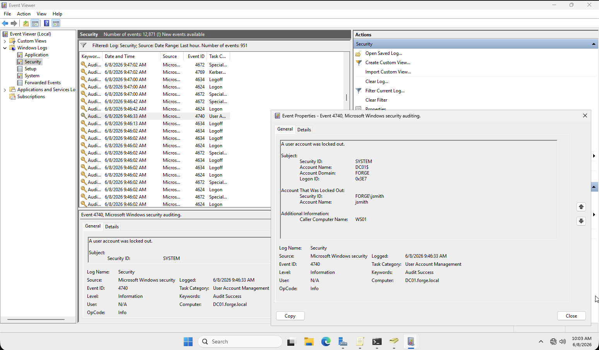
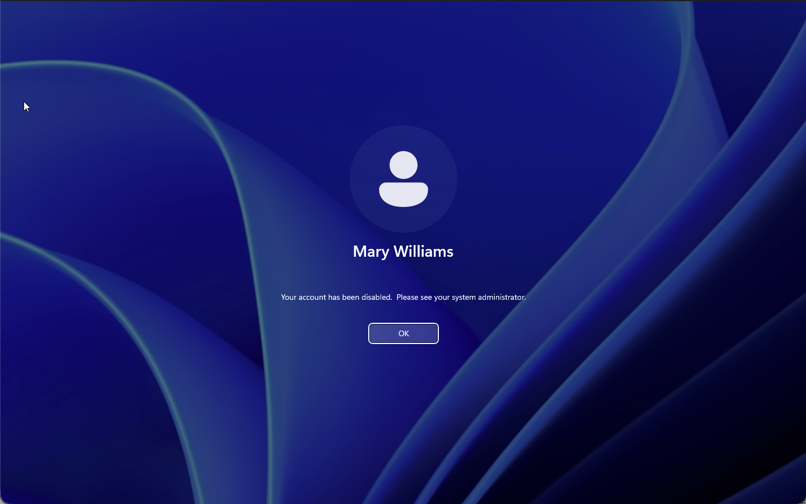
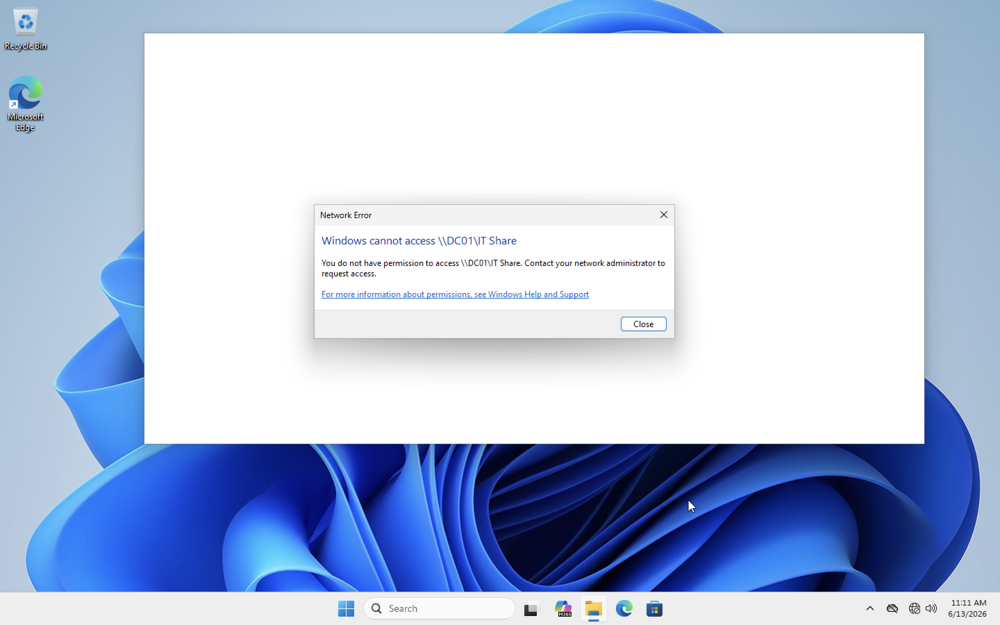

# Active Directory Home Lab — forge.local

## Overview

A fully functional Active Directory domain built from scratch on a home lab running Windows Server 2022 and Windows 11. This lab simulates a real enterprise environment — domain architecture, user and group management, Group Policy enforcement, NTFS permissions, and documented help desk incident workflows.

-----

## Environment

|Machine|OS                 |Role                  |IP           |
|-------|-------------------|----------------------|-------------|
|DC01   |Windows Server 2022|Domain Controller, DNS|192.168.56.10|
|WS01   |Windows 11         |Domain-joined client  |192.168.56.20|

- **Domain:** forge.local
- **Subnet:** 192.168.56.0/24
- **Gateway:** 192.168.56.1
- **Virtualization:** UTM on Apple M1

-----

## Domain Architecture

### Organizational Unit Structure

```
forge.local
└── _Forge
    ├── Users
    │   ├── HR
    │   │   ├── jdoe (John Doe)
    │   │   └── tsmith (Tom Smith)
    │   ├── Finance
    │   │   └── mwilliams (Mary Williams) [DISABLED]
    │   └── IT
    │       ├── jsmith (John Smith)
    │       └── rjohnson (Rachel Johnson)
    ├── Computers
    │   └── WS01
    ├── Groups
    │   ├── IT_Admins
    │   ├── HR_Users
    │   └── Finance_Users
    ├── Admins
    └── Disabled
        └── mwilliams (Mary Williams) [TERMINATED]
```

### Security Groups — Least Privilege Model

|Group        |Members             |Access Level                                   |
|-------------|--------------------|-----------------------------------------------|
|IT_Admins    |jsmith, rjohnson    |Full Control — IT_Share, elevated domain rights|
|HR_Users     |jdoe, tsmith        |Standard user access — HR resources only       |
|Finance_Users|mwilliams (disabled)|Standard user access — Finance resources only  |

-----

## What Was Built

### Domain Infrastructure

- Promoted DC01 to domain controller for forge.local forest
- Configured static IP, DNS pointing to 127.0.0.1 on DC01
- Joined WS01 to forge.local domain
- Troubleshot and resolved: IP conflict, IPv6 DNS query order, hostname collision during domain join

### User & Group Management

- Created 5 domain users across 3 department OUs
- Built 3 security groups with least privilege assignments
- Standard naming convention: first initial + last name (jsmith, rjohnson)

### Group Policy

- Created **Forge_Desktop_Policy** GPO linked to _Forge OU
- Enforced desktop wallpaper across all domain machines
- Ran `gpupdate /force` on WS01, confirmed policy applied on next login
- Configured account lockout policy: 3 invalid attempts, 30-minute lockout duration

### Shared Folder + NTFS Permissions

- Created `C:\IT_Share` on DC01
- Share permissions: IT_Admins — Full Control
- NTFS permissions: IT_Admins — Full Control only
- Verified: rjohnson (IT_Admins) — access granted
- Verified: jdoe (HR_Users) — access denied

-----

## Simulations & Incidents

### TICKET-001 — Account Lockout (jsmith)

**Scenario:** User unable to log into WS01 after multiple failed password attempts.

**Resolution:**

1. Reproduced lockout on WS01 — entered wrong password 3x
1. Pulled **Event ID 4740** from Security log on DC01 — confirmed source machine: WS01, timestamp confirmed
1. Unlocked account in Active Directory Users and Computers
1. Reset password, verified successful login on WS01

**Forensic Evidence:** Event ID 4740 — Account: FORGE\jsmith | Source: WS01



-----

### TICKET-002 — Employee Termination (mwilliams)

**Scenario:** HR department requests immediate access revocation for terminated employee Mary Williams.

**Resolution:**

1. Removed mwilliams from Finance_Users security group
1. Disabled account in Active Directory Users and Computers
1. Remotely ended active WS01 session
1. Verified login attempt — confirmed “Your account has been disabled” on WS01
1. Moved mwilliams to Disabled OU for 30-day retention before deletion

**Retention policy:** 30 days before permanent deletion review.



-----

### NTFS Permissions Test

**Scenario:** Verify least privilege enforcement on IT_Share.

|User    |Group    |Result                                        |
|--------|---------|----------------------------------------------|
|rjohnson|IT_Admins|✅ Access granted                              |
|jdoe    |HR_Users |❌ Access denied — “You do not have permission”|



-----

## Key Concepts Demonstrated

- Active Directory domain architecture and forest design
- Organizational Unit structure for administrative delegation
- Least privilege enforcement through security group membership
- Group Policy creation, linking, and verification
- Account lockout policy and Event Log forensics (Event ID 4740)
- NTFS permissions vs Share permissions — double gate model
- Employee onboarding and offboarding workflows
- Incident documentation and ticketing workflow
- Remote session management via PowerShell

-----

## Screenshots

|File                                    |Description                                     |
|----------------------------------------|------------------------------------------------|
|screenshots/event-4740-lockout.png      |Event ID 4740 — jsmith lockout forensics on DC01|
|screenshots/mwilliams-disabled-login.png|mwilliams account disabled confirmation on WS01 |
|screenshots/ntfs-access-denied-jdoe.png |jdoe access denied on \DC01\IT_Share            |
|screenshots/dc01-it-share.png           |IT_Share accessible from WS01 as rjohnson       |

-----

## Tickets

- [TICKET-001 — Account Lockout (jsmith)](tickets/TICKET-001-account-lockout-jsmith.md)
- [TICKET-002 — Employee Termination (mwilliams)](tickets/TICKET-002-account-lockout-jsmith.md)
